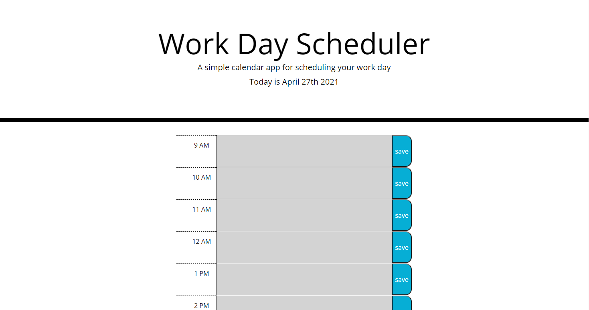

# WorkDayScheduler-Moment.js

## description

this is a very simple day planner that saves information to local storage.
this was made useing the jQuery and Moment.js APIs

this project was made to further my understanding of jQuery and the use of APIs.

i learned how to use jQuery to traverse the Dom and how to write jQuery statements.

### screenshot

### Link to

[https://ajurgs.github.io/WorkDayScheduler-Moment.js/](https://ajurgs.github.io/WorkDayScheduler-Moment.js/)

## credits

Worked on this code with my tutor Brian Lee.
